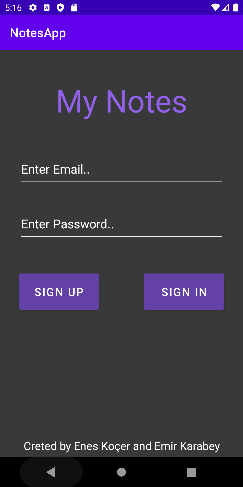
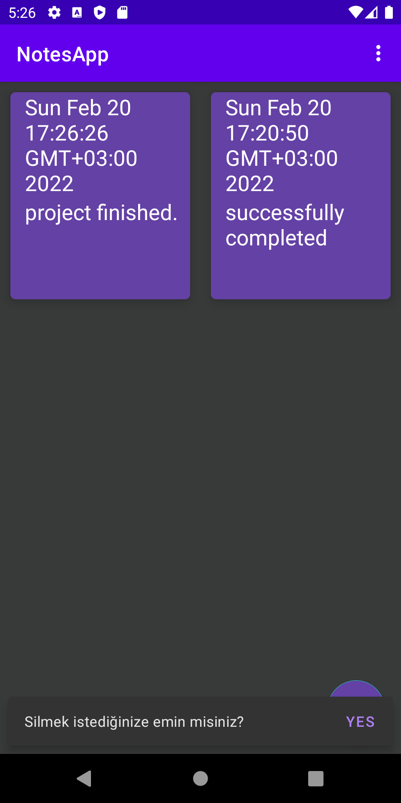
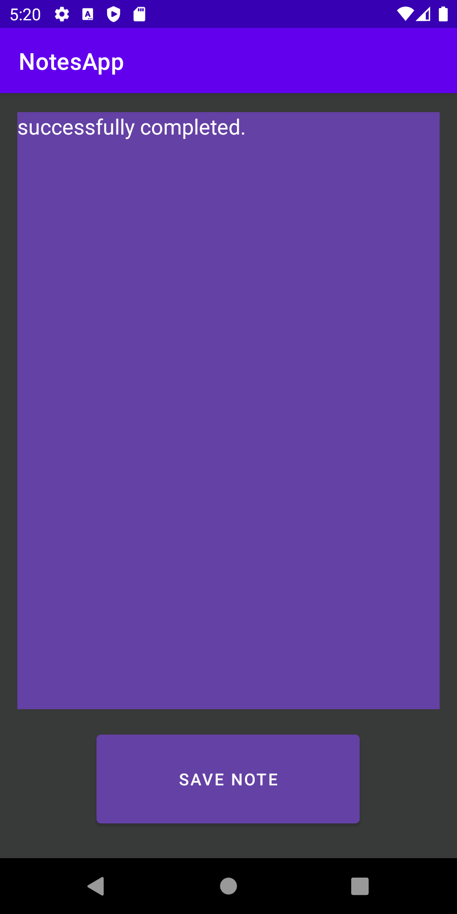

My Notes
=========
In this repository we made note storage app with Android. Written in Kotlin implements the Jetpack libraries, Firebase services.

Screenshots
-----------

Libraries Used
* [Foundation][0] - Components for core system capabilities, Kotlin extensions and support for
  multidex and automated testing.
  * [AppCompat][1] - Degrade gracefully on older versions of Android.
  * [Android KTX][2] - Write more concise, idiomatic Kotlin code.
* [Architecture][10] - A collection of libraries that help you design robust, testable, and
  maintainable apps. Start with classes for managing your UI component lifecycle and handling data
  persistence.
  * [View Binding][11] - a feature that allows you to more easily write code that interacts with views.
  * [Navigation][14] - Handle everything needed for in-app navigation.
     asynchronous tasks for optimal execution.
* [UI][30] - Details on why and how to use UI Components in your apps - together or separate
  * [Fragment][34] - A basic unit of composable UI.
  * [Layout][35] - Lay out widgets using different algorithms.

* [Firebase](https://firebase.google.com/docs) - Tools to develop high-quality apps.
  * [Authentication](https://firebase.google.com/docs) - Allows an app to securely save user data in the cloud. (we used with email/password)
  * [Cloud Firestore](https://firebase.google.com/docs/firestore) - Flexible, scalable NoSQL cloud database to store and sync data.

[0]: https://developer.android.com/jetpack/components
[1]: https://developer.android.com/topic/libraries/support-library/packages#v7-appcompat
[2]: https://developer.android.com/kotlin/ktx
[10]: https://developer.android.com/jetpack/arch/
[11]: https://developer.android.com/topic/libraries/view-binding
[14]: https://developer.android.com/topic/libraries/architecture/navigation/
[30]: https://developer.android.com/guide/topics/ui
[34]: https://developer.android.com/guide/components/fragments
[35]: https://developer.android.com/guide/topics/ui/declaring-layout
